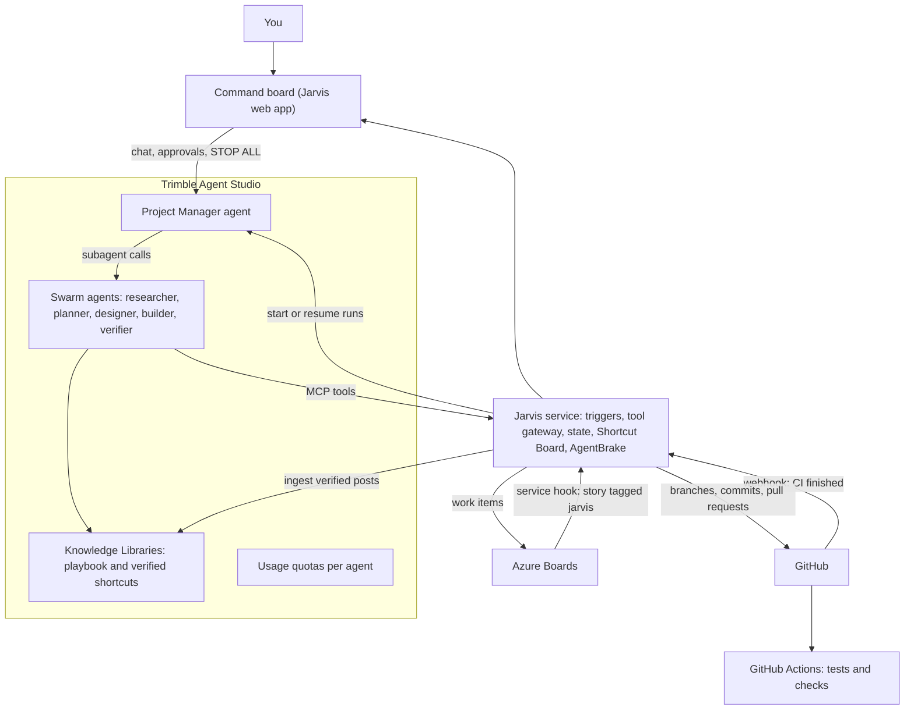
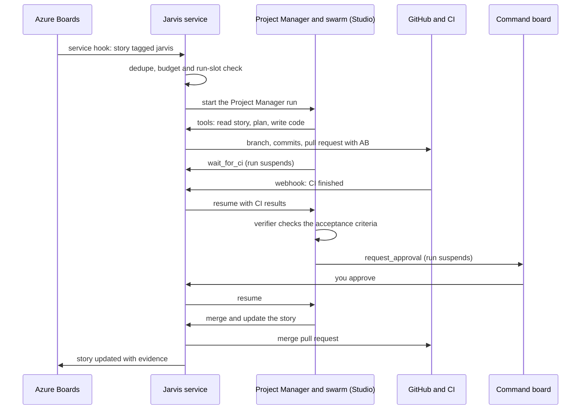
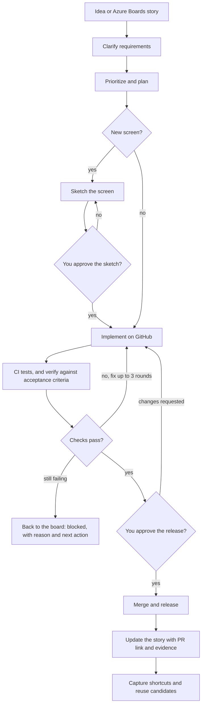
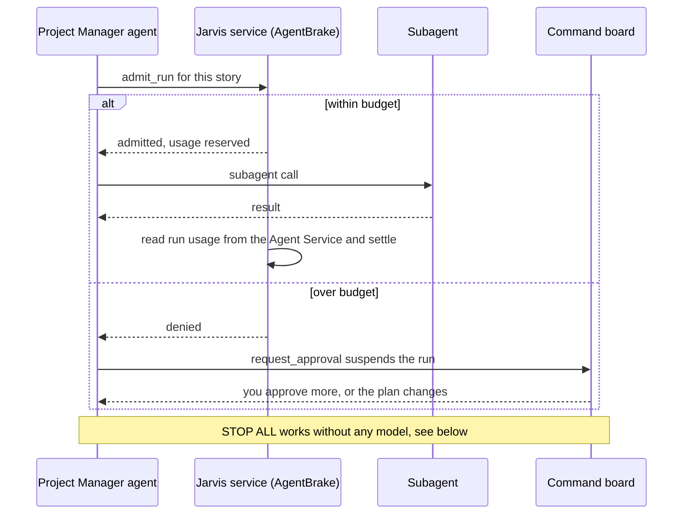
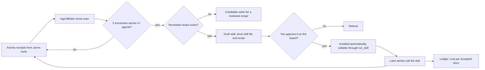
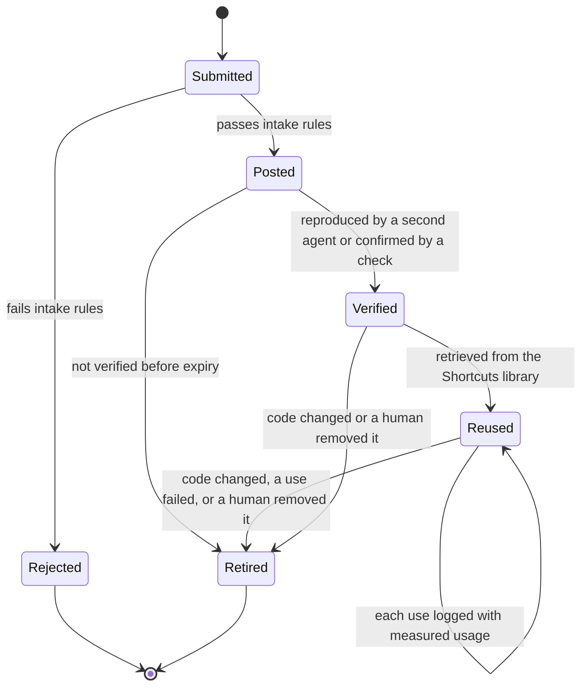
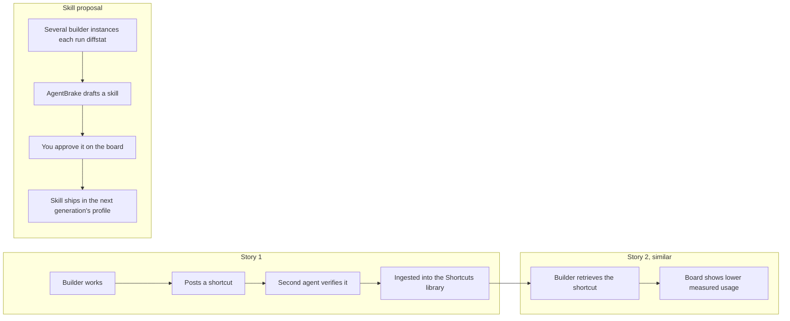

# Project Jarvis

An AI product team for a single product, built on Trimble Agent Studio: a Project Manager chat and visual command board that orchestrate a swarm of agents through the product's full development lifecycle. Project Jarvis turns ideas and the product's Azure Boards stories into scoped work, designs, GitHub pull requests, tested changes, and release proposals. Token Police (Studio's usage quotas plus AgentBrake) keeps execution within limits the team controls, and a Shortcut Board lets agents pass verified shortcuts to each other, so the team gets cheaper the more it works.

## Core experience

- **Project Manager chat:** Your AI project manager for the product. Give direction, set priorities, approve decisions, and unblock work.
- **Command board:** Track Azure Boards stories, active agents, dependencies, blockers, pull requests, checks, usage, shortcuts, and skill proposals in one place.
- **Agent swarm:** Researcher, planner, designer, builder, and verifier cooperate on bounded tasks. Roles share evidence and handoffs rather than repeating work.
- **Token Police:** Studio's usage quotas cap every agent; AgentBrake adds per-story budgets, pauses work that hits them, flags repeated failures, and reports cost per accepted story. Deterministic, with zero model calls.
- **Shortcut Board:** Agents post shortcuts, gotchas, and repo facts for each other. Only verified posts reach other agents, and repeated procedures become reusable skills after human approval.

## Built on Trimble Agent Studio

Studio hosts the agents and their knowledge. It does not run code, store shared state, host dashboards, or receive webhooks, so one small companion app, the **Jarvis service**, holds those parts. That split is the pattern Trimble's own platform agent recommends.

| Jarvis piece | Where it lives | How |
| --- | --- | --- |
| Project Manager | Studio agent | Orchestration instructions as its system prompt; the team playbook in a Knowledge Library |
| Swarm | Studio agents, one per role | The Project Manager dispatches them as subagents through the Agent Service. Each agent picks its model from Trimble's model gateway (Gemini, OpenAI, Claude, Meta); the verifier uses a different family from the builder |
| Stories | Azure Boards | Agents read and update work items through the tool gateway |
| Code, pull requests, CI | GitHub and GitHub Actions | The builder creates a branch, commits file changes, and opens the pull request through the tool gateway. There is no sandbox in Studio, so stories stay small. CI runs on the pull request |
| Tool gateway | Jarvis service, registered in Studio as one MCP server | Hosts the official Azure DevOps and GitHub MCP servers, limited to the tools agents need. Real credentials stay in the Jarvis service |
| Triggers | Jarvis service | Receives Azure Boards service hooks and GitHub webhooks, then starts or resumes agent runs |
| Human approval | A local tool, `request_approval` | The run suspends until you click Approve or Deny on the command board, which submits the tool's result |
| Waiting on CI | A local tool, `wait_for_ci` | The run suspends while CI runs and resumes when GitHub reports the result, so no agent burns tokens waiting |
| Token Police | Studio quotas plus AgentBrake in the Jarvis service | Studio caps runs and tokens per agent; AgentBrake handles per-story budgets, reuse detection, and cost per accepted story through Jarvis tools |
| Shared state and the Shortcut Board | Jarvis service database | Studio has no durable store agents can write, so story state and board posts live here |
| Verified shortcuts for agents | A "Shortcuts" Knowledge Library | Verified posts are ingested one job per post; agents find them through normal retrieval |
| Command board | Jarvis service web app | Calls the Agents API and embeds the Trimble Assist chat component for the Project Manager chat |

### How it fits together

### The tool gateway

Studio's Tool Registry can't yet confirm Microsoft Entra sign-in for app identities, so agents never connect to Azure DevOps or GitHub directly. The Jarvis service runs Microsoft's Azure DevOps MCP server (work-item tools only) and GitHub's MCP server (repo, pull request, and Actions tools only) behind one HTTP endpoint, registered in Studio with a static token per agent.

- **Credentials:** an Azure DevOps personal access token scoped to work items for the hackathon, moving to an Entra service principal afterward; a GitHub fine-grained token scoped to the one repo, or a GitHub App so commits show up as Jarvis. Neither reaches Studio or a model.
- **One choke point:** every Azure Boards and GitHub action passes through the Jarvis service, so AgentBrake records it, STOP ALL can block it, and per-agent tokens show who did what.
- **Size limits:** responses are trimmed and paginated to stay under Studio's roughly 100 KB tool-response limit.
- **Later:** if the Tool Registry adds Entra app sign-in, Studio can point straight at Microsoft's hosted Azure DevOps server.

## Triggers

Nothing runs until an event arrives. The Jarvis service receives every event, ignores duplicates (one active run per story), checks budgets and run slots, and only then starts or resumes a run. No separate automation tool is needed.

| Event | Arrives as | The Jarvis service |
| --- | --- | --- |
| A story is tagged `jarvis` | An Azure Boards "Work item updated" service hook, with a shared secret | Confirms the tag, checks budget and run slots, starts the Project Manager run with the story's details |
| CI finishes on a Jarvis pull request | A GitHub webhook | Resumes the run waiting on `wait_for_ci` |
| You approve or deny | The command board | Resumes the run waiting on `request_approval` |
| You message the Project Manager | The command board chat | Sends it to the Agents API |
| STOP ALL | The command board | Cancels runs, blocks tools, cancels CI |
| Scheduled housekeeping | The service's own schedule | Runs AgentBrake's reuse scan and retires stale shortcuts |

Only tagged stories start work: the tag is a human saying "Jarvis, take this one", and it keeps cost predictable. With the Azure Boards app for GitHub connected, writing `AB#<id>` in the pull request links it to the story, so Azure Boards shows the pull request and its checks.

## Delivery loop

Idea or Azure Boards story → clarify requirements → prioritize and plan → sketch and approve new screens → implement on GitHub → test and review → approve release → update the story and capture feedback → capture shortcuts and reuse candidates.

Stories close only when acceptance criteria are verified and the result is linked. Blocked work returns to the board with a concrete reason and next action.

## Token Police

Two layers. **Studio's Usage Quota Enforcement** is the hard ceiling: run limits and input and output token limits per agent, over a sliding window, with real-time usage stats. **AgentBrake** ([Roberto-Madrid/agent-brake](https://github.com/Roberto-Madrid/agent-brake), MIT) runs inside the Jarvis service as a deterministic layer, Python and SQLite with no model calls, and adds what quotas alone don't:

- **Before every subagent run:** the Project Manager calls the Jarvis `admit_run` tool, and AgentBrake checks the story's budget. A denial makes the Project Manager call `request_approval`, which suspends the run and puts a "budget reached" card on the board.
- **After every run:** the Jarvis service reads the run's usage from the Agent Service and settles it in AgentBrake. Missing cost stays "unknown"; nothing is estimated as fact.
- **Repeated failures:** AgentBrake counts them and raises an exception card, which goes to the owner on the board instead of yet another retry.
- **Measured savings only:** the board shows cost per accepted story from the ledger. A shorter output is not reported as a saving.

### STOP ALL

One button, three layers, none of which needs a model:

1. The command board cancels every active run through the Agent Service's runs API.
2. The Jarvis service switches to stopped: every Jarvis tool, including `admit_run` and the Azure Boards and GitHub tools, refuses, so no agent can start or continue work.
3. In-progress GitHub Actions runs for Jarvis branches are cancelled.

## Self-improvement loop

1. Every operation that goes through a Jarvis tool (for example `diffstat`, `run-checks`, `secret-names`) is recorded as an activity receipt, using one shared operation vocabulary.
2. AgentBrake scans the ledger: three successful runs of the same operation across at least two agents make a reuse candidate.
3. For operations with a reviewed recipe, AgentBrake drafts a small skill: a short skill file plus a deterministic script.
4. The draft appears on the board as a skill proposal. A human approves it, and its file hashes are verified, before any agent can use it.
5. Approved skills go live automatically the moment you approve: the Jarvis service installs the skill, and one generic `run_skill` tool runs any installed, hash-verified skill, with `list_skills` telling agents what's available. Nothing has to be re-registered in Studio. Later stories call the script instead of spending tokens, and the ledger shows whether cost per accepted story actually dropped.

Operations without a reviewed recipe stay candidates until an agent authors one and it passes normal review.

## Shortcut Board

The Hugging Face incident showed that agents sharing a board get far more capable. This board keeps that benefit and removes what made it dangerous.

**Post types**

- **Shortcut:** a faster sanctioned way to do something ("run the unit tests for one module with `npm run test:unit -- <path>` during development").
- **Gotcha / dead end:** what not to try, and why.
- **Repo fact:** where things live and how they connect.
- **Reuse candidate:** a procedure worth turning into a skill, handed to AgentBrake.

**Every post carries** the authoring agent (recorded by the Jarvis service from the calling agent's token, never self-declared), its story, its project and repo scope, the commit it was true for, evidence (a command and its output, a test run, or a link), and an expiry.

**Lifecycle:** posted → verified (a second agent reproduces it, or a deterministic check confirms it) → reused (each use logged, with measured usage) → retired (when the code it describes changes, it fails once, or a human removes it). Unverified posts never reach other agents.

**How agents use it:** agents post and verify through Jarvis tools. Only verified posts are ingested into the Shortcuts Knowledge Library, one ingestion job per post with a stable document ID, so agents find relevant shortcuts through normal retrieval and never see unverified ones. Retiring a post removes its document.

**Rules, enforced by the Jarvis service before a post is accepted**

- Shortcuts stay within the agent's own permissions. No exploits, sandbox escapes, or use of infrastructure the team hasn't approved.
- No shortcut may skip, weaken, or fake verification. Posts that disable tests, edit expected results, or skip hooks (for example `--no-verify`) are rejected. A builder may use targeted tests while working, but the full CI checks still run before review.
- No secrets. Secret-shaped strings are rejected and the attempt is flagged.
- Posts are information, not instructions. No agent can assign work to another or ask another to take risks; only the Project Manager assigns work.
- Scope is enforced: a post never crosses into another project or client.
- Every post and every use is in the audit log, and a human can retire any post from the board.

## Hackathon scope

Prove one complete loop: tag a small Azure Boards story `jarvis`, have agents produce a tested GitHub pull request, check it with the verifier, and return the evidence to the dashboard and the story. Show human approval (a suspended run resumed from the board), a budget pause (an AgentBrake denial), and STOP ALL working.

Then show the team improving itself:

- On the first story, an agent posts a shortcut; a second agent verifies it, and it appears in the Shortcuts library.
- On the second, similar story, the builder retrieves it, and the board shows lower measured usage than on the first.
- Several builder instances each run `diffstat` on their own pull requests. AgentBrake detects the repetition across instances, drafts a skill, and a human approves it on the board. The approved skill ships in the next generation's builder profile.

For a reliable demo, the board also has a "Run with Jarvis" button that starts a story exactly like the tag does, in case the service hook is slow on stage.

## Boundaries

Agents, knowledge, and quotas live in Trimble Agent Studio; models come from Trimble's model gateway, chosen per agent. Only what Studio can't host lives in the Jarvis service: triggers, the tool gateway, the command board, shared state, the Shortcut Board, AgentBrake, and the ingestion job. Disposable workers, at most three concurrent subagent runs, no automatic paid fallback. New screens require sketch approval before application code. Publishing and merging require human approval. STOP ALL works without relying on a model.

Tool responses stay under Studio's size limit, so diffs and work-item payloads are paginated. AgentBrake keeps one local SQLite ledger inside the Jarvis service. Skills install only after human approval. Board posts can't skip checks, carry secrets, or direct other agents. AgentBrake is a pre-existing MIT open-source dependency, declared as such in the submission.

**Still to confirm before the hackathon:**

- The exact runs list and cancel endpoints (developer.ai.trimble.com/api/agents).
- Where the Jarvis service may be hosted inside Trimble, reachable by Azure DevOps service hooks and GitHub webhooks.
- Credentials: an Azure DevOps token or service principal for work items, and a GitHub fine-grained token or GitHub App for the repo.
- Permission to add a service hook in the Azure DevOps project and a webhook on the GitHub repo, and to connect the Azure Boards app for GitHub.

## Team lanes

Command board and Project Manager chat (Trimble Assist embed) · Studio agents, subagent orchestration, Token Police, and the Shortcut Board · triggers, the tool gateway (Azure Boards and GitHub), CI, and ingestion · verification and demo.

**Success:** A real backlog story becomes a reviewable, tested pull request with visible progress, accountable decisions, and controlled usage, and the next similar story costs measurably less because the agents reused what the first one learned.
